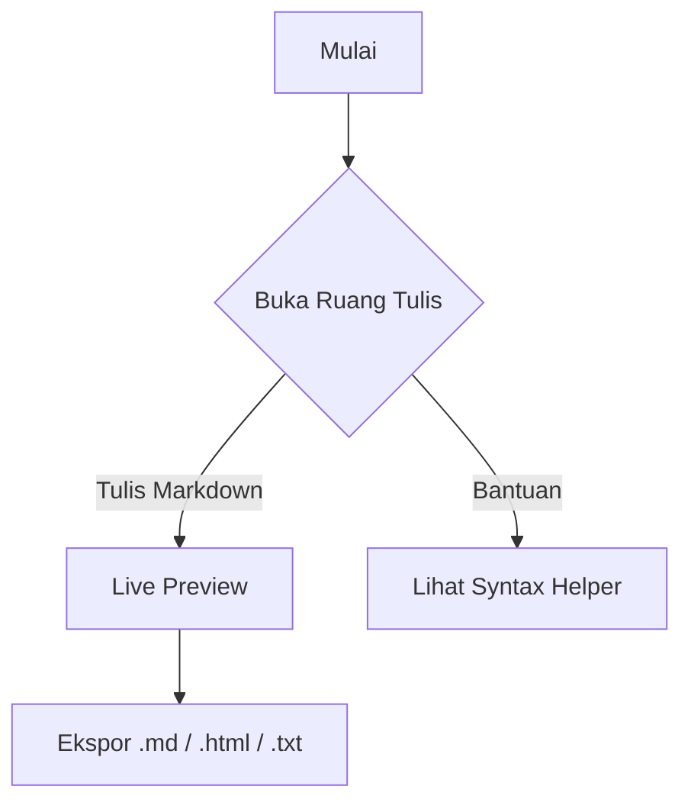

# Ruang Tulis by Alhazen

Selamat datang di **Ruang Tulis by Alhazen**! Dokumen ini memuat seluruh contoh syntax Markdown dan fitur interaktif yang didukung oleh editor ini.

[TOC]

---

## 1. Heading (Judul)
# Heading 1
## Heading 2
### Heading 3

---

## 2. Format Teks
- **Teks Tebal** (`**tebal**`)
- *Teks Miring* (`*miring*`)
- ~~Teks Coret~~ (`~~coret~~`)
- `Inline Code` (`\`kode\``)

---

## 3. List & Checklist
- Item tidak bernomor
- Item kedua
  - Sub-item
1. Nomor satu
2. Nomor dua
- [x] Tugas selesai
- [ ] Tugas belum selesai

---

## 4. Blockquote & Garis Pemisah
> "Pendidikan adalah senjata paling ampuh untuk mengubah dunia." — Nelson Mandela

---

## 5. Link & Gambar
- [Kunjungi Website Alhazen Academy](https://alhazen.academy)
- Gambar Logo:


---

## 6. Blok Kode (Syntax Highlighting)
```python
# Contoh Kode Python
def sapa(nama):
    return f"Halo, {nama}! Selamat belajar coding di Alhazen."

print(sapa("Kawan"))
```

```html
<!-- Contoh Kode HTML -->
<div class="card">
    <h2>Halo Alhazen</h2>
    <p>Belajar coding jadi menyenangkan!</p>
</div>
```

---

## 7. Tabel
| Fitur | Status | Keterangan |
| :--- | :--- | :--- |
| Live Preview | Aktif | Render sinkron |
| Mermaid.js | Aktif | Diagram & flowchart |
| KaTeX | Aktif | Rumus matematika |
| Footnotes | Aktif | Catatan kaki interaktif |

---

## 8. Kotak Peringatan (Admonitions)
:::success Berhasil
Dokumen berhasil disimpan secara lokal ke browser Anda!
:::

:::info Informasi
Ruang Tulis by Alhazen dapat digunakan gratis tanpa batas.
:::

:::warning Perhatian
Pastikan mengunduh berkas Anda sebelum membersihkan cache peramban.
:::

:::danger Peringatan
Jangan simpan kredensial atau kunci rahasia pada perangkat bersama.
:::

---

## 9. Diagram Alir (Mermaid)


---

## 10. Rumus Matematika (KaTeX)
Rumus inline seperti $x^2 + y^2 = r^2$ dan rumus blok:

$$E = mc^2$$

---

## 11. Catatan Kaki (Footnote)
Catatan kaki sangat berguna untuk memberikan rujukan atau penjelasan tambahan[^1]. Anda juga dapat menggunakan label berbasis kata[^info-alhazen].

[^1]: Ini adalah rujukan untuk catatan kaki pertama.
[^info-alhazen]: Alhazen Academy adalah platform pembelajaran coding dan teknologi terpercaya.
